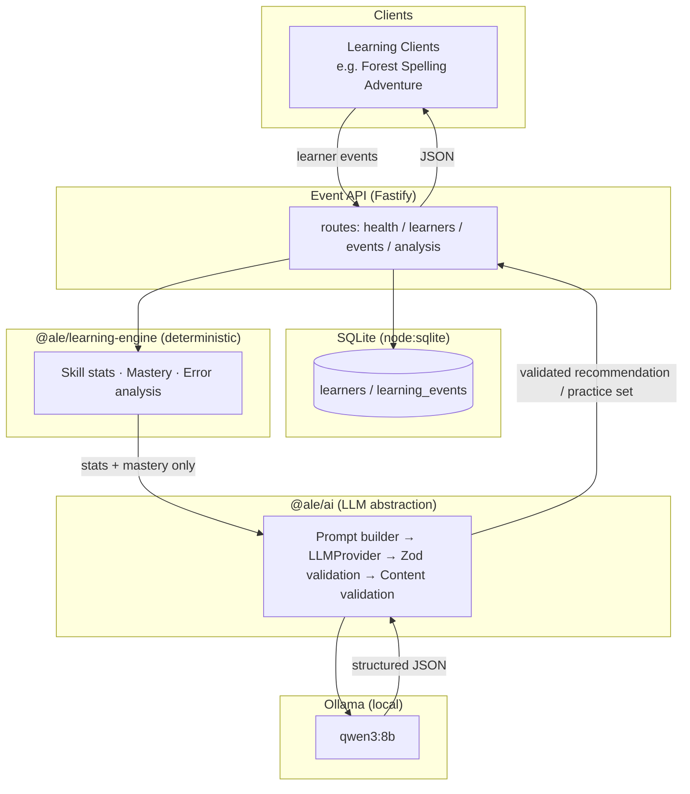

# AI-Powered Learning Engine

A learning analytics engine that turns raw learner events (questions attempted,
correct/incorrect answers, error types, response times) into skill profiles,
mastery estimates, and AI-generated practice recommendations — powered by a
**locally running LLM via Ollama**. No learner data ever leaves the machine,
and no paid cloud LLM API is used.

Phase 1 targets early literacy / phonics, but the data model and architecture
are domain-agnostic: the same `LearningEvent` shape can carry reading, math, or
vocabulary interactions in the future.

## 1. Project Overview

The engine sits between learning-game clients (e.g. a spelling game) and a
local LLM. It:

1. Ingests structured learner events over a small HTTP API.
2. Computes **deterministic** statistics and mastery estimates — no AI involved.
3. Sends only the pre-computed statistics (never raw events) to a local LLM to
   generate a structured, validated practice recommendation.
4. Optionally generates candidate practice items, which pass through a content
   validation layer before ever reaching a learner.

The LLM interprets and generates; it never decides correctness, scores,
unlocks, or mastery — those stay deterministic application logic.

## 2. Architecture



Package boundaries (also see `apps/` and `packages/`):

| Layer | Package | Responsibility |
|---|---|---|
| API | `apps/api` | HTTP routes, SQLite persistence, request validation, error mapping |
| Learning engine | `packages/learning-engine` | Deterministic stats, mastery formula, error analysis — **no AI** |
| AI | `packages/ai` | `LLMProvider` abstraction, Ollama implementation, prompts, schemas, content validation |
| Shared | `packages/shared` | Cross-cutting types, Zod request schemas, constants |
| Web | `apps/web` | Minimal developer dashboard (React + Vite) |

The API is the only layer allowed to call into `@ale/ai`, and it only ever
passes `@ale/ai` a small, pre-digested statistics bundle — never raw events or
database rows.

## 3. Prerequisites

- Node.js 20+ (uses the built-in `node:sqlite` module — no native build step)
- npm 10+
- [Ollama](https://ollama.com) installed and running locally

## 4. Ollama Installation

Install Ollama for your platform from <https://ollama.com/download>, then
confirm it's running:

```bash
ollama --version
```

On Windows/macOS, Ollama runs as a background app after installation and
exposes its HTTP API at `http://localhost:11434`.

## 5. Model Installation

Pull the default model used by this project:

```bash
ollama pull qwen3:8b
```

Verify it's available:

```bash
ollama list
```

> **Note on local inference speed:** `qwen3:8b` on CPU-only hardware (no GPU)
> can take anywhere from ~20 seconds (a single recommendation) to over a
> minute (a full 12-item practice set) per request. This is expected — the
> API's Ollama client uses a generous 180-second timeout and disables the
> model's "thinking" trace (`think: false`) to keep responses as fast as
> possible. If you have a GPU, Ollama will use it automatically and responses
> will be much faster.

## 6. Local Development

```bash
npm install
cp .env.example .env
npm run db:migrate
npm run db:seed
npm run dev
```

- `npm run db:seed` prints a demo learner ID with ~40 events showing a clear
  short-vowel weakness alongside strong initial/final-sound skills — use it
  to exercise `/analyze` and `/practice` meaningfully.
- `npm run dev` starts the API on `http://localhost:3000` (configurable via `PORT`).

### Running the web dashboard

The frontend is a separate workspace, run independently of the root `dev` script:

```bash
npm run dev --workspace=apps/web
```

This starts Vite on `http://localhost:5173` with a dev proxy forwarding
`/learners` and `/health` requests to the API on port 3000 (so no CORS
configuration is needed in development). Paste a learner ID (from the seed
script's output) into the dashboard to load their profile and request an AI
recommendation.

### A note on this environment's npm script policy

If your npm is configured with a restrictive `allow-scripts` policy (as this
project's environment was), a plain `npm install` may be refused with
`EALLOWSCRIPTS`. None of this project's dependencies require install scripts
to function (`esbuild`'s platform binaries arrive via `optionalDependencies`,
not a postinstall step), so it's safe to install with that policy's env-level
default cleared for the one command, e.g. on a POSIX shell:
`npm_config_allow_scripts= npm install`.

## 7. API Endpoints

| Method | Path | Description |
|---|---|---|
| GET | `/health` | Liveness check |
| GET | `/health/ollama` | Ollama availability + configured model |
| POST | `/learners` | Create an anonymous learner (`{ displayName?, age? }`) |
| GET | `/learners/:learnerId` | Fetch a learner |
| GET | `/learners/:learnerId/profile` | Deterministic per-skill mastery breakdown (no AI) |
| POST | `/learners/:learnerId/events` | Submit one learning event (native shape) |
| POST | `/api/v1/events` | Compatibility ingestion for game clients speaking their own event envelope (see below) |
| POST | `/learners/:learnerId/analyze` | Deterministic stats + mastery + AI recommendation for a skill (defaults to the weakest skill; pass `{ "skill": "..." }` to target one) |
| POST | `/learners/:learnerId/practice` | AI-generated, content-validated practice items for the recommended focus |

CORS is enabled permissively (`origin: true`, reflecting any request origin) so
a learning-game client on its own dev port can call this API directly from the
browser. Tighten this to an explicit allowlist before any non-local deployment.

### Game client compatibility: `POST /api/v1/events`

The reference client, Forest Spelling Adventure, generates and persists its own
anonymous learner id client-side and posts a richer event envelope than this
API's native shape — it never calls `POST /learners` first. `POST
/api/v1/events` accepts that envelope as-is and adapts it into the same core
`LearningEvent` the rest of the system uses, auto-creating the learner by its
client-generated id if it doesn't exist yet:

```json
{
  "eventId": "f3bdd5af-...",
  "learnerId": "c99e77bb-...",
  "applicationId": "forest-spelling-adventure",
  "eventType": "answer_submitted",
  "activity": { "levelId": "level-1", "puzzleId": "level-1-puzzle-2", "skillId": "cvc-short-vowels", "targetWord": "pin" },
  "interaction": { "selectedAnswer": "pit", "correct": false, "responseTimeMs": 6193.5, "attemptNumber": 1 },
  "metadata": { "foilType": "FC" },
  "timestamp": "2026-10-04T15:36:05.505Z"
}
```

`eventId`/`applicationId`/`eventType` are accepted but not currently persisted
— they're reserved for future multi-client/multi-event-type support. This
route was added by capturing and reverse-engineering the actual fetch calls
the running game made (its JSON payload, not just its URL), after discovering
`/learners/:learnerId/events` alone doesn't fit a client that never creates a
learner explicitly.

All errors follow the same shape and never leak stack traces:

```json
{ "error": { "code": "LEARNER_NOT_FOUND", "message": "No learner found with id \"...\"." } }
```

Error codes: `VALIDATION_ERROR` (400), `LEARNER_NOT_FOUND` (404),
`NO_EVENTS_FOUND` (404), `OLLAMA_UNAVAILABLE` (503), `OLLAMA_TIMEOUT` (504),
`INVALID_AI_RESPONSE` (502), `INTERNAL_ERROR` (500).

## 8. Database Schema

See [`database/schema.sql`](database/schema.sql). Two tables:

- **`learners`** — anonymous id, optional display name/age, timestamps. No
  names, emails, or other identifying data are required.
- **`learning_events`** — one row per attempt: skill, target, selected
  answer, correct/incorrect, foil type, difficulty, response time, attempt
  number, timestamp.

Migrations are a single idempotent `schema.sql` applied via `npm run db:migrate`
(all statements use `IF NOT EXISTS`, safe to re-run).

## 9. AI Architecture

- **`LLMProvider`** (`packages/ai/src/provider.ts`) — the only interface the
  rest of the app depends on: `generateText`, `generateStructured`, and an
  optional `checkHealth`. `OllamaProvider` is the current implementation; a
  future cloud or alternative local provider can be added without touching
  the learning engine or API.
- **Prompts** (`prompts.ts`) are pure functions over pre-digested statistics
  — easy to unit test without a running model.
- **Structured output**: requests send a JSON Schema (derived from the Zod
  response schema via `zod-to-json-schema`) as Ollama's `format` parameter,
  and `think: false` is set since `qwen3` is a hybrid-reasoning model and we
  want fast, final JSON rather than a visible chain-of-thought trace.
- **Validation pipeline**: `LLM response → JSON.parse → Zod structural schema
  → one correction retry on failure → content validation (business rules,
  per-item filtering) → safe content`. Structural schema validation
  (`schemas.ts`) deliberately checks only shape/types — business rules like
  "choices must include the target word" live in `contentValidation.ts` and
  **filter individual bad items** rather than failing an entire response.
  This matters in practice: local 8B-class models don't always follow every
  instruction on every item, and discarding a whole 12-item practice set
  because one item was malformed would be wasteful and unnecessary.
- **Never trusted**: the LLM cannot determine correctness, scores, unlocks,
  or mastery. It only interprets deterministic statistics and generates
  candidate content, which is always validated before use.

## 10. Learning Engine Architecture

All of `packages/learning-engine` is pure, deterministic TypeScript — no AI,
fully unit-testable.

- **`skillAnalysis.ts`** — per-skill attempt counts, accuracy, average
  response time, foil-type error tally, and recent-vs-historical accuracy
  (events are sorted chronologically first, so "recent" means most-recently
  attempted regardless of submission order).
- **`mastery.ts`** — the mastery formula:

  ```text
  mastery = 0.40 × overallAccuracy
          + 0.35 × recencyScore
          + 0.15 × consistencyScore
          + 0.10 × errorPatternScore
  ```

  - `overallAccuracy`: correct / attempts, all-time.
  - `recencyScore`: accuracy over the most recent window of events (falls
    back to overall accuracy when there isn't a distinct recent window yet).
    Weighted second-highest because recent performance best predicts current
    ability.
  - `consistencyScore`: `1 - |recentAccuracy - historicalAccuracy|` — a big
    swing between recent and historical performance lowers this score;
    defaults to 1.0 when there isn't enough history to compare yet.
  - `errorPatternScore`: `1 - (share of errors from the single most common
    foil type)` — concentrated errors on one specific misconception (e.g.
    always confusing short vowels) score lower than scattered errors,
    defaulting to 1.0 when there are no recorded errors.
  - A skill with zero attempts, or zero *correct* answers, always scores 0 —
    consistency/error-pattern credit is only meaningful once there's some
    evidence of competence to weigh it against.
  - Result is clamped to `[0, 1]` and rounded to 2 decimals.

- **`errorAnalysis.ts`** — identifies the dominant foil/error type for a skill.
- **`learnerProfile.ts`** — aggregates per-skill stats + mastery across a
  learner's full event history; overall mastery is a simple average.
- **`recommendations.ts`** — builds the exact, narrow statistics bundle
  (`SkillAnalysisBundle`) that is allowed to cross into the AI layer.

## 11. Testing

```bash
npm test
```

64 tests across three layers, **none require a running Ollama instance**:

- **Learning engine** (`packages/learning-engine/tests`) — accuracy, mastery
  formula edge cases, error aggregation, recent-vs-historical splits, skill
  profile aggregation.
- **AI** (`packages/ai/tests`) — prompts and schemas are tested directly;
  `OllamaProvider` is tested against a mocked `fetch` (valid response, retry
  on malformed JSON, failure after retry, timeout, connection failure, health
  check); `analyzer`/`generator` are tested against a hand-written fake
  `LLMProvider`; content validation is tested against the exact failure mode
  observed from a real local model (a target missing from its own choices).
- **API** (`apps/api/tests`) — valid/invalid events, missing/unknown learner,
  the full analyze/practice flow via a fake provider, and an unavailable-AI
  scenario asserting a clean `503` with no leaked internals. Uses an
  in-memory SQLite database (`:memory:`) per test via Fastify's `inject()`.

## 12. Privacy Considerations

- Learner identity is a random id; `displayName`/`age` are optional and
  collected only if supplied.
- No learner data leaves the machine — inference runs entirely through the
  local Ollama instance.
- The API never depends on OpenAI, Gemini, Anthropic, or any other paid cloud
  LLM API.
- The AI layer is explicitly instructed not to make medical, psychological,
  or disability diagnoses, and the application never lets AI output
  determine correctness, scoring, or unlocks.

## 13. Future Roadmap

1. Adaptive practice generation
2. Forest Spelling Adventure integration
3. Teacher/parent analytics dashboard
4. Long-term learner modeling
5. Multi-language support
6. Optional cloud synchronization
7. Additional `LLMProvider` implementations (local and cloud)

Explicitly out of scope for Phase 1: RAG/embeddings, authentication, cloud
deployment, and multi-agent systems.
